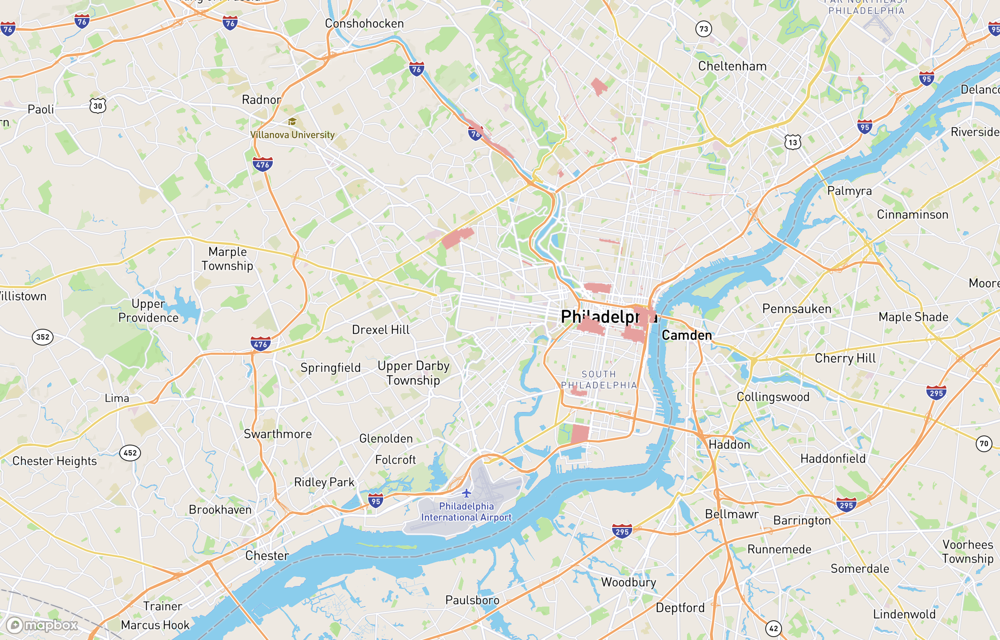
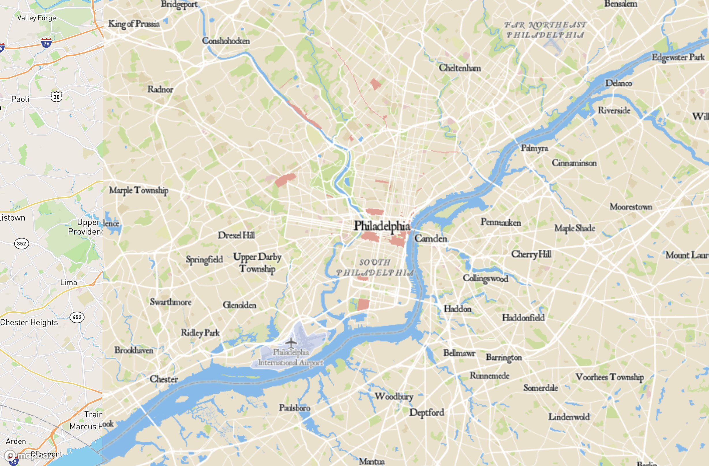

# tilset-generation

##  Map 1

My map 1 is a basemap with a historical theme in Philadelphia, PA. As such, I uploaded a custom font, and chose beige colors for a more historical script like theme. 

## Map 2 

Map 2 is a thematic layer of historical districts in Philadelphia, PA. This was from [OpenDataPhilly](https://www.opendataphilly.org/dataset/philadelphia-registered-historic-districts). The background is transparent. 

## Map 3

Map 3 is a combination of the first two tilesets, so it displays the historic districts in Philadelphia along with the base map layer from map 1, adding a historical theme. 

## Map 4

Map 4 is an edited mapbox layer themed around the colors of the NBA team from Philadelphia, the 76ers, since I am a big sports fan. I chose to use the exact colors from their website, and used the default icons, but chose to display only the icons instead of place names. 